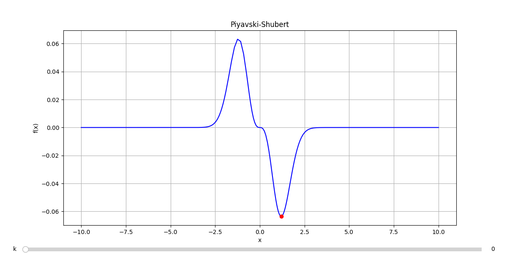
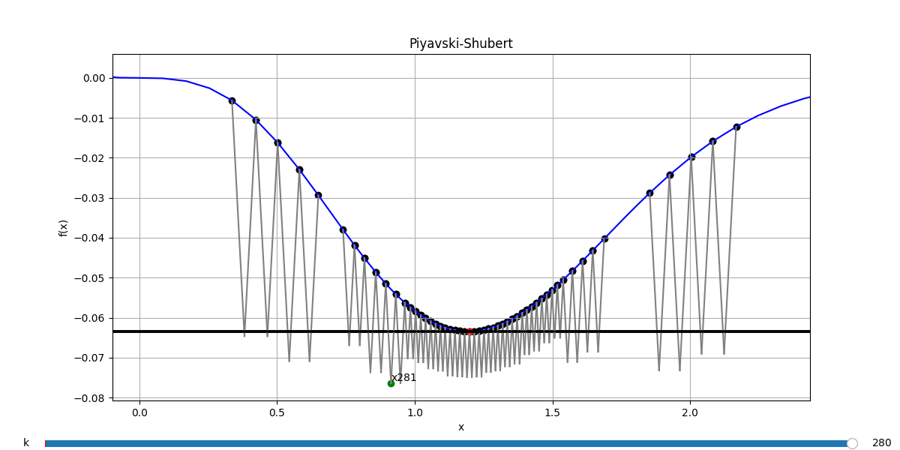

# **Piyavskii–Shubert Global Optimization Algorithm**

This repository provides a Python implementation of the **Piyavskii–Shubert algorithm**, a global optimization method designed for **Lipschitz-continuous functions**.

## Repository Structure

- **piyavskishubert** – Main entry point for running the algorithm.
- **src/** – Contains the core implementation of the algorithm, including tree-based search logic.
- **functions.py** – Collection of benchmark test functions (you can add your own here).
- **results.txt** – Stores the output of test runs and results.

## What Is the Piyavskii–Shubert Algorithm?

The **Piyavskii–Shubert algorithm** is a deterministic method for **global optimization** of 1D Lipschitz-continuous functions. Given a known Lipschitz constant \( L \), it constructs lower bounds using piecewise linear underestimators and iteratively refines the search interval to converge toward the global minimum.

### Tree-Based Search Strategy

This implementation extends the classical method using a **tree structure** to manage intervals in a priority queue. The tree allows the algorithm to:

- **Efficiently partition the search domain**
- **Prioritize promising intervals**
- **Prune suboptimal nodes** using bounding techniques

This pruning mechanism significantly improves performance by discarding regions of the domain that cannot contain the global minimum.

## Usage

```bash
piyavskishubert [-h] [-f FUNCTION] [-n MAX_IT] [-e EPS] [-H HMAX] [-d]
````

### Options:

| Flag           | Description                                                                 |
| -------------- | --------------------------------------------------------------------------- |
| -h, --help | Show the help message and exit                                              |
| -f FUNCTION  | Function to optimize (e.g. f3, f15...) – see functions.py             |
| -n MAX_IT    | Maximum number of iterations                                                |
| -e EPS       | Desired precision                                                           |
| -H HMAX      | Maximum height of the tree (controls depth of search)                       |
| -d           | Enable **Display Mode** (interactive visualization of optimization process) |

## Display Mode

In **Display Mode**, a graphical interface is shown to visualize the function, the interval nodes, and the search process.

```bash
$ ./piyavskishubert -f f20 -d
```

```
Piyavskii–Shubert for the function f20 over x ∈ [-10, 10], with L = 1.3
eps=0.001
n=10000
hmax=10

(x*, y*) = (1.1985, -0.0634)

k: 281
pruned: 228 nodes
time: 0.0498 s
```



A **scrollbar** under the plot allows you to browse through each iteration, showing:

* The node being expanded
* Candidate nodes in the priority queue



> **Note:** To avoid UI rendering issues, display mode runs with preset parameters. You can customize these by modifying the script directly.

## Compute Mode (Headless Execution)

**Compute Mode** allows you to run the optimization without displaying the function or nodes. Ideal for benchmarks, batch runs, or headless environments.

```bash
$ ./piyavskishubert -e 0.000001 -H 10 -n 100000 -f f10
```

```
Piyavskii–Shubert for the function f10 over x ∈ [0, 10], with L = 11
eps=1e-06
n=100000
hmax=10

(x*, y*) = (7.9786, -7.9167)

k: 1623
pruned: 630 nodes
time: 0.0076 s
```

### Performance Tip

Reducing the maximum tree height (**Hmax**) can lead to **better performance** with similar accuracy.

```bash
$ ./piyavskishubert -e 0.000001 -H 5 -n 100000 -f f10
```

```
Piyavskii–Shubert for the function f10 over x ∈ [0, 10], with L = 11
eps=1e-06
n=100000
hmax=5

(x*, y*) = (7.9786, -7.9167)

k: 458
pruned: 395 nodes
time: 0.0024 s
```

Here, the same optimal solution was found in **less than half the time**, thanks to limiting the tree height.

## Add Your Own Functions

To test custom functions:

1. Open **functions.py**
2. Define your function as **def fXX(x):** where **XX** is a unique identifier.
3. Specify the domain and Lipschitz constant accordingly.

## Credits

This project was made by [@apaonessaa](https://github.com/apaonessaa).

## License

This repository is licensed under the GNU GPL v3.

---
